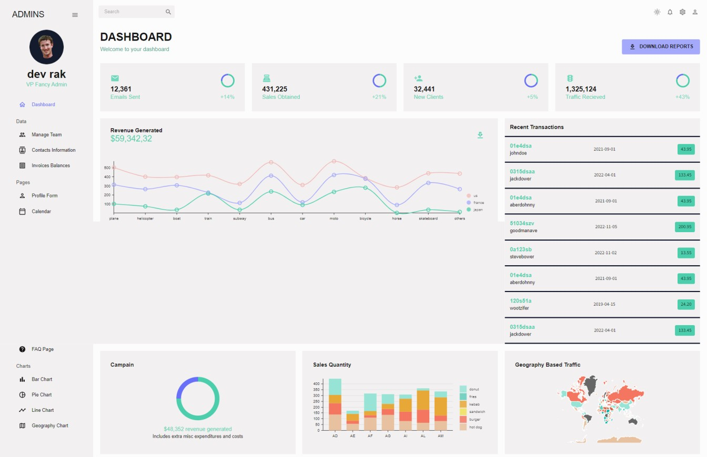
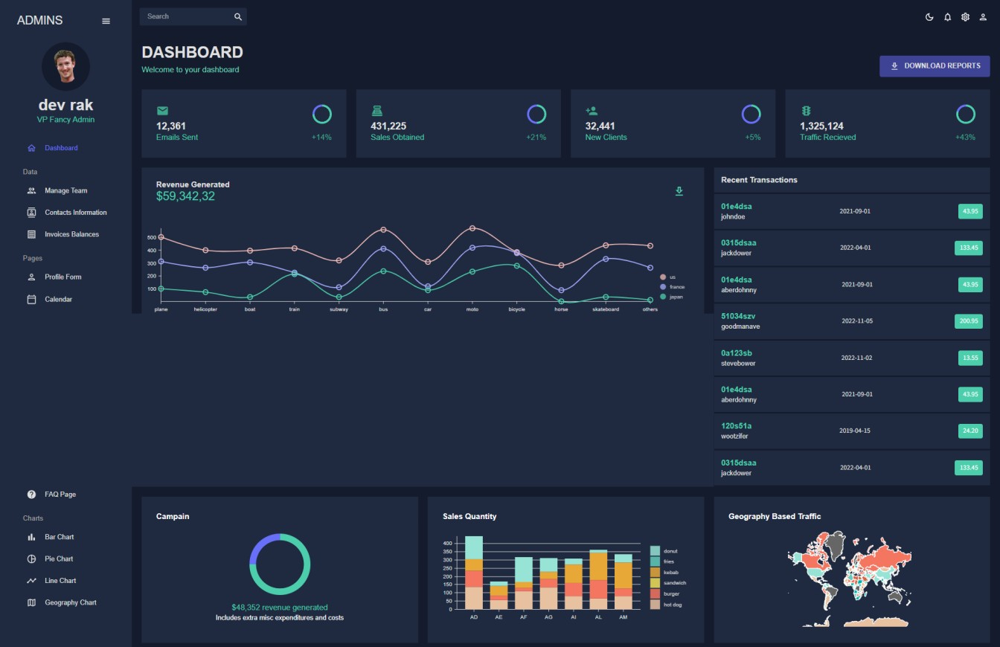
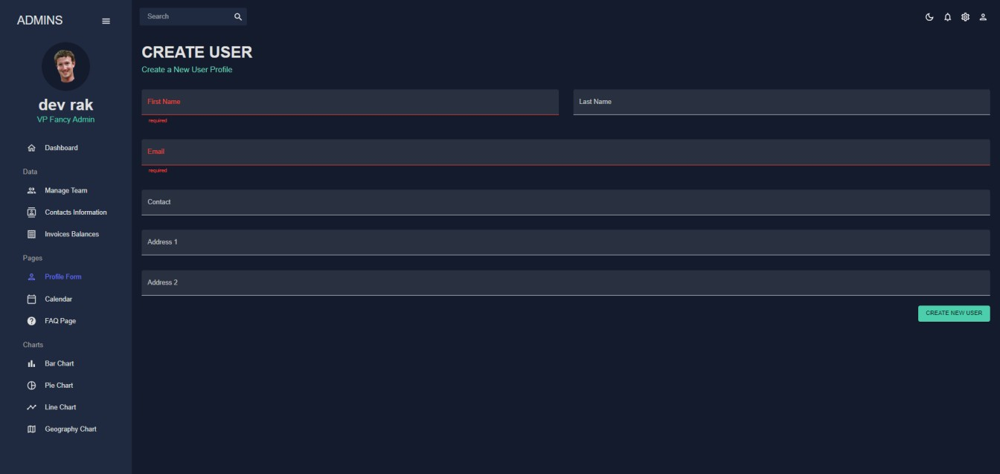
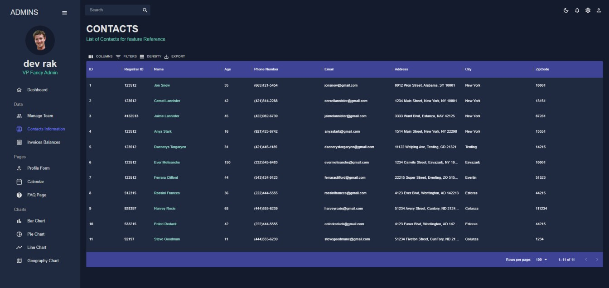
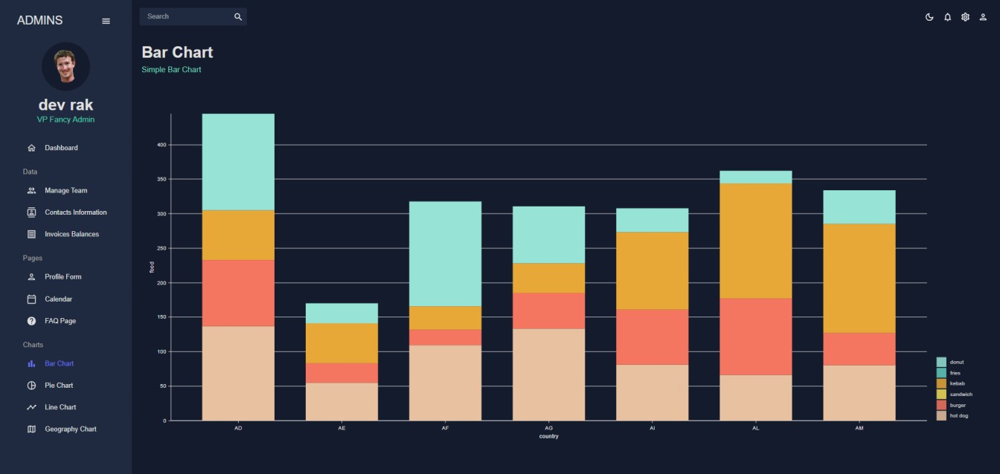
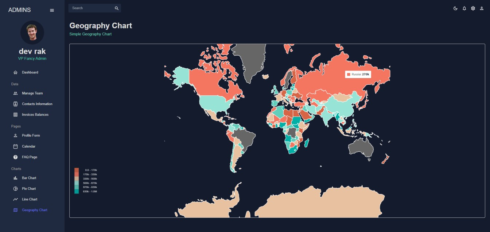

# :closed_book: Admin Dashboard

### _full admin dashboard using react !!_

### Link :link: https://rak-full-admin-dashboard.netlify.app/bar

## Interface

## Run Locally

  - Run This command `https://github.com/developer-rak/admin_dashboard_full.git`
  - You are now in the dev environment and you can play around

## ✨ Features

  - SideBar Navigation Menu
  - Light Mode
  - Dark Mode
  - (Dashboard, Manage Team (create member delete member)
  - Contacts Information (ID, Register ID, Name, Age, Phone no;, Email, Address, City, ZipCode)
  - Invoices
  - Profile Form (Submit form for user)
  - Calender (you can store events delete events)
  - FAQs

  - BarChart
  - PieChart
  - LineChart
  - GeographyChart

## ⚙️ Tech Stack
  - HTML5
  - CSS
  - Mui Material UI
  - Mui Icons
  - Mui DataGrid
  - React
  - react-proSidebar
  - react-redux
  - yup
  - react-charts
  - react-icons
  - Chart.js
  - Formik
  - Nivo All Charts
  - Netlify
